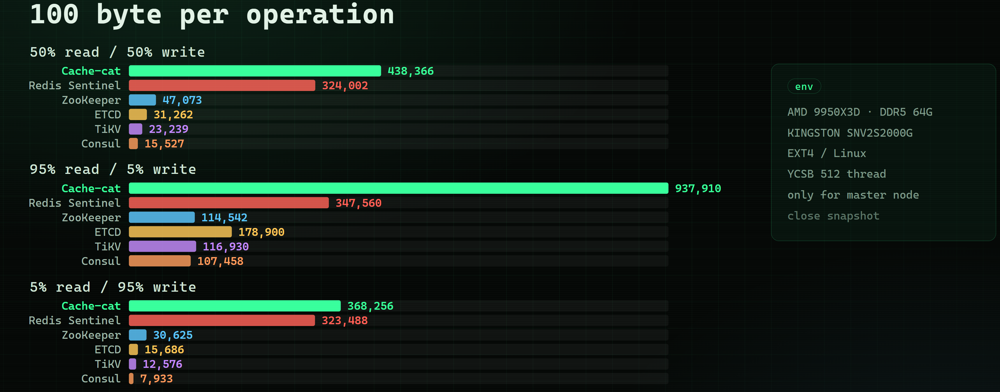

# cache-cat

<a href="https://github.com/nasuiyile/cache-cat/blob/master/README.md">English</a> ｜
<a href="https://github.com/nasuiyile/cache-cat/blob/master/README_zh.md">简体中文</a> |
<a href="https://nasuiyile.github.io/cache-cat-website">Official Website</a>

## Introduction

cache-cat is a high-performance key-value caching library that uses the Raft consensus protocol to provide both high availability and strong data consistency.

cache-cat aims to build an extremely high-performance, Raft-based, fault-tolerant caching framework. Compared with caching systems such as Redis and Memcached, cache-cat is designed to ensure that committed data is not lost. The project with the most similar positioning is:

[RedisLabs/redisraft: A Redis Module that makes it possible to create a consistent Raft cluster from multiple Redis instances.](https://github.com/RedisLabs/redisraft)

However, RedisRaft is only a lab project.

> Even when using Redis clustering strategies, Redis may still lose data. Redis clustering primarily addresses availability rather than strong data consistency.

Compared with more widely known service-discovery and coordination systems such as etcd, ZooKeeper, and Consul, cache-cat also uses a consensus algorithm and is designed to provide reliable data storage.

However, under the same environment and with default configurations, the performance and latency of these systems still cannot match cache-cat. For example, cache-cat can achieve approximately 500k writes per second, while TiKV achieves around 200k writes per second. In addition, these middleware systems were not originally designed for caching scenarios, so they lack many features commonly required by cache systems, such as LRU and LFU eviction policies and maximum memory usage limits.

## Benchmark

YCSB throughput benchmark results:

## Features

For many small companies, you may simply want to build a highly available application without introducing a large number of middleware services.

In theory, cache-cat can be used as:

- **A key-value database:** Similar to TiKV, it can store critical data that must not be lost.
- **Service discovery / configuration center:** Similar in positioning to Consul and ZooKeeper, it can be used as a service registry and configuration center. Client-side adaptation is required.
- **A cache:** Similar in positioning to Redis, Dragonfly, and Valkey. Most cache workloads are read-heavy, and cache-cat's read performance is designed to be competitive with these systems. For writes, according to one survey, many systems have a read/write ratio of approximately 95:5, and caching itself cannot accelerate write operations. cache-cat can still provide 500k+ write operations per second, which is sufficient for the vast majority of use cases.
- **Distributed locks:** Similar to ZooKeeper and etcd. Unlike Redis-based distributed locks, Redis distributed locking has relatively more caveats and potential issues, even when using Redlock: [Is Redlock safe?](https://antirez.com/news/101).

**Use cases:** You should consider cache-cat when you need to ensure that data is not lost. For example, you may want to keep all user data in memory for long-term storage and fast reads. You may need a distributed lock and do not want that lock to become invalid because of a node failure. You may also want to store critical configuration data and ensure that it is not lost when a node fails.

For many other scenarios, you can still choose traditional cache systems such as Redis. For example, if you simply want to preload frequently accessed configuration data that is originally stored in a database, a traditional cache may be perfectly suitable.

See the [Benchmark](#benchmark) section above for YCSB throughput results. A more complete benchmark section will be added as cache-cat's functionality becomes more mature.

## Consistency Model

> A commonly discussed consistency problem concerns dual-write consistency between a cache and a database.
>
> [In-depth | Ctrip's Practices for Eventual-Consistency and Strong-Consistency Caching](https://mp.weixin.qq.com/s/E-chAZyHtaZOdA19mW59-Q)
>
> This is different from the consistency model of the database itself. The consistency discussed below refers to the database's own consistency model, rather than dual-write consistency between a database and a cache.
>
> In simple terms, if the latest value written by a write operation can be read immediately, the system can be regarded as strongly consistent. Externally, the system exposes the semantics of a single state machine.
>
> If it takes some time before the latest written value becomes visible to reads, the system can be regarded as eventually consistent.

## Q&A

You may be wondering how cache-cat differs from or relates to the following systems. The questions below explain these differences one by one.

### Q: What is the difference between cache-cat and TiKV?

TiKV is a database implementation that uses a Raft engine for log replication and RocksDB as its storage layer. For performance reasons, cache-cat does not persist state-machine data to disk.

---

### Q: Can Redis really lose data, even when using clustering strategies?

Yes. Neither Redis Cluster nor Sentinel uses a consensus algorithm for replication.

The typical processing order is that the primary node replies to the request first and then synchronizes the data to replica nodes. If the primary crashes after replying to the request but before replicating the write to a replica, that write may be permanently lost after a new primary is elected.

Redis clusters can also encounter split-brain scenarios.

---

### Q: Raft requires data to be written to disk and replicated to follower nodes before a request can return. Doesn't this conflict with the efficiency goals of a cache?

More precisely, Raft persists operation logs. Raft itself does not dictate where the state-machine data must be stored.

In cache-cat, state-machine data is stored entirely in memory using hash maps and other data structures. If you want an analogy, the data that needs to be persisted can be compared to Redis AOF logs.

For reference, ZooKeeper's entire ZNode tree and Consul's key-value data are stored in memory, while etcd persists its data to disk.

For a cache system, synchronization and disk flushing inevitably increase write latency compared with an otherwise equivalent pure in-memory cache. However, read operations do not require any additional disk I/O.

We believe that cache systems care more about read latency than write latency, and we believe this trade-off is worthwhile: slightly higher write latency in exchange for preventing committed data from being lost.

---

This project includes code derived from:

- https://github.com/lichuang/coredb
- https://github.com/lichuang/rockraft

Licensed under the Apache License 2.0.